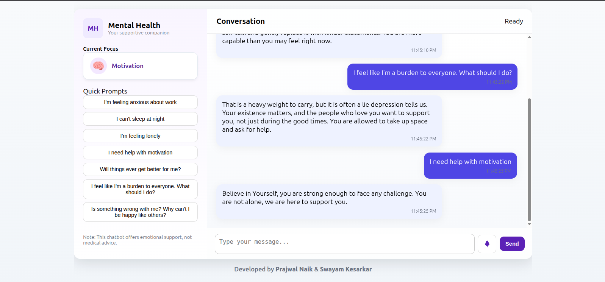

# Mental-Health ChatBOT v2
This chat bot helps you understand your mental health issue and understands your feelins very well.

A conversational AI assistant that provides empathetic, context‑aware mental‑health support. Built with **Retrieval‑Augmented Generation (RAG)**, the bot can pull relevant information from a curated dataset to enrich its responses, ensuring users receive accurate and helpful guidance.


## A Demo 


---

## ✨ Features

- **Real‑time chat** with natural language understanding.
- **RAG integration** – leverages `dataset.json` to retrieve pertinent information.
- **Privacy‑first design** – all data stays local; no external logging.
- **Customizable prompts** – adapt the tone and style to your needs.

---

## Installation Guide

```bash
# Clone the repository
git clone https://github.com/LightYagami625/Mental-Health-ChatBOT_v2.git
```

```bash
# Navigate into the project directory
cd Mental-Health-ChatBOT_v2
```

```bash
# Create a virtual environment (optional but recommended)
python3 -m venv venv
```
```bash
source venv/bin/activate # For Linux / Mac Users
```
```bash
venv\Script\activate # For Windows Users
```

```bash
# Install dependencies
pip install -r requirements.txt
```

---

## Usage

```bash
# Run the Flask application
python app.py
```

Open your browser and visit **http://127.0.0.1:5000**. You’ll be greeted by a sleek chat interface where you can start a conversation.

---


## License

This project is licensed under the **MIT License** – see the `LICENSE` file for details.

---

Developed by
-Prajwal Naik [https://github.com/Prajwalnaik4563]


-Swayam Kesarkar [https://github.com/LightYagami625]


*Created on 2025‑12‑15*
